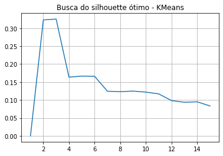
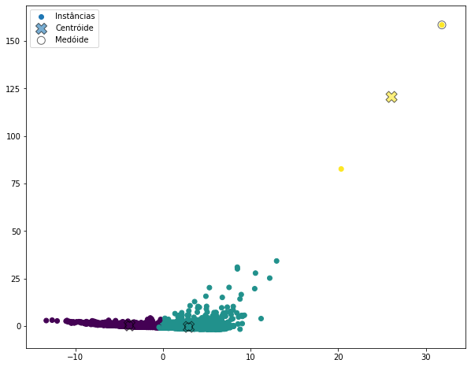
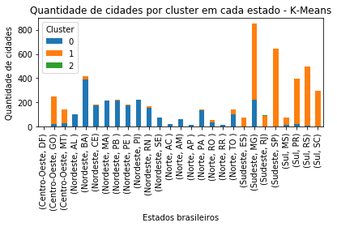

# PUC-MBA
Trabalho de conclusão do MBA PUC-Rio

## TEMA CENTRAL
Este trabalho tem por ideia central a utilização de metodologias já difundidas para calcular uma pontuação (score) com relação à igualdade de gênero para todos os municípios brasileiros. Baseada nos critérios apresentados pelo índice GGI - Global Gender Gap Index, a ideia central é partir desta nova variável – somada às demais variáveis escolhidas - encontrar agrupamentos e características que permitam distinguir perfis de cidades que possuem maior igualdade de gênero.

## OBJETIVO:
* Analisar quais perfis de municípios brasileiros são possíveis distinguir com relação à igualdade de gênero.

## BASE DE DADOS:
A base de dados foi construida pela autora, é resultado de uma composição de três fontes distintas: 

**Dados para construção do score de gênero:** Censo 2010- IBGE, Tribunal Superior Eleitoral (TSE) – Eleições 2010 (governadores e senadores), Tribunal Superior Eleitoral (TSE) – Eleições 2008 (prefeitos e vereadores).

**Dados básicos municipais:** publicados do Altas de Desenvolvimento Humano (IPEA, 2013), que consolida os principais dados do censo 2010 realizado pelo IBGE, a nível municipal.

**Dados gerais municipais:** obtidos através de raspagem de dados no site IBGE cidades (https://cidades.ibge.gov.br/brasil). 

## METODOLOGIA
Após avaliação e tratamento dos dados faltantes na base de dados, a base foi padronizada para posterior utilização nos algoritmos selecionados: K-Means e Agglomerative Clustering. Foi utilizada uma abordagem de otimização de hiperparâmetros para verificação do número de clusters ideais para cada algoritmo e avaliados através do método Silhouette e Elbow, identificou-se que o numero mais adequado para este dataset seria 3 clusters.

 

## APLICAÇÃO DOS ALGORITMOS
### K-Means
 

### Agglomerative Clustering

## RESULTADOS
